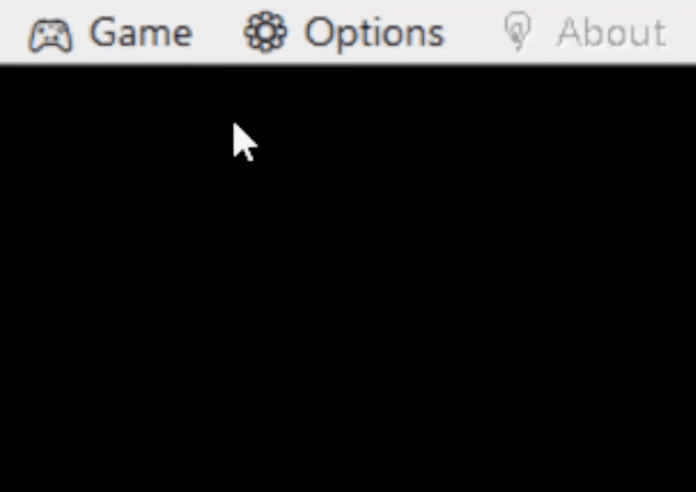

  <h1 id="-----">

  

  </h1>

<h1 id="-----">
  

</h1>

    

 

## 📄 Prerequisite

There various methods to make a Pokémon fangames. The most notable ones are:

- Using [Pokémon Essentials](https://pokemon-fan-game.fandom.com/wiki/Pok%C3%A9mon_Essentials), A base [RPG Maker XP](https://www.rpgmakerweb.com/products/rpg-maker-xp) project that comes with its own debugger, map connector and alot of free tools, It is community driven project, and is always up-to-date! RPG-Maker-XP only compiles games to Windows, so these are essentially Windows only games!
- By [ROM Hacking](https://en.wikipedia.org/wiki/ROM_hacking), These are created by editing the base ROM of _legally owned_ Pokémon game, We will be taking only [GameBoy Series](https://en.wikipedia.org/wiki/Game_Boy_Advance) and [Nintendo DS](https://en.wikipedia.org/wiki/Nintendo_DS) in account, since they have the most used games as base Image. These Fangames are made for their respective console, but can be played on any device using [Emulator](https://en.wikipedia.org/wiki/Emulator)!

 

## 💼 About

<i><b>"</b>Those who play Pokémon Games, typically have alot of them<b>"</b></i>  ~ My Experience

**PokéShelf** is a living gallery that hosts all games downloaded/installed by the User, May it be _Essentials_ game or GBx/NDS ROM!

- PokéShelf itself is themed like a Pokémon game menu, with almost no mouse input and key bindings similar to _Emulators_ and _Essentials_ game, all this to maintain the Immersion.
- Once Configured, Play Games Directly from PokeShelf, even the ones that require Emulator!
- You can Add Custom Background Image/Video and Custom Music for each fangame.
- Auto Add functionality for BG and Music for most of the _Essentials_ Games, To enable this functionality with ROMs or with your incompatible _Essentials_ Game, Check the [BG Auto-Add Guide](#-how-bg-auto-add-works).
- Lastly, A Quit-to-Tray Option, if required, _I personally never used It._

 

## 💥 Get Started

You are First Encountered with the **Splash** Screen, Add a game in order to get in the **Shelf**.

 

( **θ** ) **Controls**:

| Action       | Key                                   |
| ------------ | ------------------------------------- |
| Escape       | `<Esc>` │ `<X>`|
| Navigation   | ⬆️ │ `<Shift-Tab>`  ; ⬇️ │ `<Tab>`|
| Adjust Value | ⬅️ ; ➡️|
| Enter        | `<Enter>` │ `<C>` │`<Z>` │`<Space>` |

 
 

**( I )**  Open **Options** by Press `Alt + S` *(S as in Settings)* or Click on `Options` in Menu Bar.

<table align="center"><tr><th  align="center"><h3><code>Alt + S</code></h3></th><th>

</th></tr></table>

- Adjust Music Volume

  

- Adjust Screen Size, >= L recommended

  

- You can't update Game Order within Shelf, Edit it in `config.json`.

  

- Add GBx Emulator if you intend to add GameBoy ROMs, [VisualBoy Advance](https://visualboyadvance.org/) is tested and recommended, It can emulate all GameBoy Series consoles (`.gb`, `.gbc`, `.gba`)

  

- Add NDS Emulator if you intend to add Nintendo DS ROMs, [DeSmuME](https://desmume.org) is tested and recommended.

  

- Activate Quit-to-Tray Option, if required

  

- `Save` to remember this for next time, `Cancel` to revert back or Press `Esc` to simply use these settings as a one time thing.

  

  

**( II )**  Open **Add Game** by Press `Ctrl + A` *(A as in Add)* or Click on `Game > Add Game` in Menu Bar.

<table align="center"><tr><th  align="center"><h3><code>Ctrl + A</code></h3></th><th>

</th></tr></table>

- Add Essentials Game (`.exe`) **or** GBx ROM (`.gb`, `.gbc`, `.gba`)  **or** NDS ROM (`.nds`). *(While Adding ROMs make sure to have already added respective Emulator or else Save Button won't work)*
-  As soon as you add Game, [Auto Add]((#-how-bg-auto-add-works)) functionality would kick in for `BG Image/Video` and `BG Music`, But incase it doesn't, You have ability to Manualy Select Both of Them
   - File type for `BG Image/Video`: `.png`, `.jpg`, `.jpeg`, `.bmp`, `.gif`, `.mp4`, `.mkv`, `.webm`, `.avi`, `.mov`
   - File type for `BG Music`: `.wav`, `.ogg`, `.flac` (unfortunately `.mid` is not yet supported)
   - If it doesn't kick in, To enable this functionality with ROMs or with your incompatible _Essentials_ Game, Check the [BG Auto-Add Guide](#-how-bg-auto-add-works), and go to edit menu and readd the game.
   
   

   
- Press `Save`, It will send into the `Shelf` Screen, with your game displayed on front, `Cancel` will send you back to `Spash` Screen.

  

  

**( III )**  Once A Game is Added, You can go to **Shelf** Screen by `Ctrl + S` *(S as in Shelf)* or Click on `Game > PokeShelf` in Menu Bar.

<table align="center"><tr><th  align="center"><h3><code>Ctrl + S</code></h3></th><th>

</th></tr></table>

- You can use `<Left>`-`<Right>` to navigate b/w Games; Press `<Enter>` to Exit Shelf and **Start** the selected Game!
- To **Remove Game**, Simpily naviagte to the game you want to remove and Press `Ctrl + R` *(R as in Remove)* or Click on `Game > Remove Game` in Menu Bar.

  <table align="center"><tr><th  align="center"><h3><code>Ctrl + R</code></h3></th><th>

</th></tr></table>
- To **Edit Game**, Simpily naviagte to the game you want to edit and Press `Ctrl + E` *(E as in Edit)* or Click on `Game > Edit Game` in Menu Bar.

  <table align="center"><tr><th  align="center"><h3><code>Ctrl + E</code></h3></th><th>

</th></tr></table>

  

**( IV )**  To get Details about the app, Press `Alt + A` *(A as in About)* or Click on `About` in Menu Bar.

<table align="center"><tr><th  align="center"><h3><code>Alt + A</code></h3></th><th>

</th></tr></table>
  

## 📜 How BG Auto-Add Works!

Background files are added automacially for Essentials Games, This is see how a typical Essentials Game Folder Structure Looks:

<table align="center"><tr><td width="50%">So, Shelf automatically looks for <ul><li><code>BG Img/Vid</code> in <code>./Graphics/Titles/</code></li><li><code>BG Music</code> in <code>./Audio/BGM/</code></li></ul></td><td>

</td></tr></table>

 

### Priority List for File Name: 

*Lower the Rank, Higher the Priority*

1. **`Shelf`**: for example, `shelf.gif` , `SHelf.mp4`, `ShElf.ogg`

2. **`GameName`** : 
   - **Folder Name** for an **Essentials Game**, e.g.:`eSsEnstiAls gAme.png`, `Pokemon Uranium.wav` 
   -  ROM **File Name** for **ROM**, e.g.: `radical-red-v2.3a.jpg`, `unbound-v1.1.3.1.ogg `
   
3. **`Title`** : First file with name starting with **title**, e.g.: `title1.mkv`, `TitLe-random.flac`

4. **`Splash`** : First file with name starting with **splash**, e.g.: `splash151.mkv`, `splash-splish.ogg`

    

**To Make your Essentials Game PokéShelf Compactible, Developers are Recommended to use `Shelf`**

 

### Recommended Folder Structure for ROMs: 

<table align="center"><tr><td width="50%">Since Shelf is already checking for files in <code>./Graphics/Titles/</code> and <code>./Audio/BGM/</code>, We can create those folders and just add files there, (for each of the roms)   <code>Shelf</code>, <code>Title</code> and <code>Spalsh</code> will display the same Image for all the ROMs, therefore <b><code>GameName</code></b> is the only one applicable when you have more than one ROM.</td><td>

</td></tr></table>

 

**To Make your Fan ROM PokéShelf Compactible, Developers are Recommended to use `GameName`**

 

 

## 🤙Contact Me

 

 

  <h3> Made with <b>❤️</b> by<b>〈 RA 〉</b></h3>

